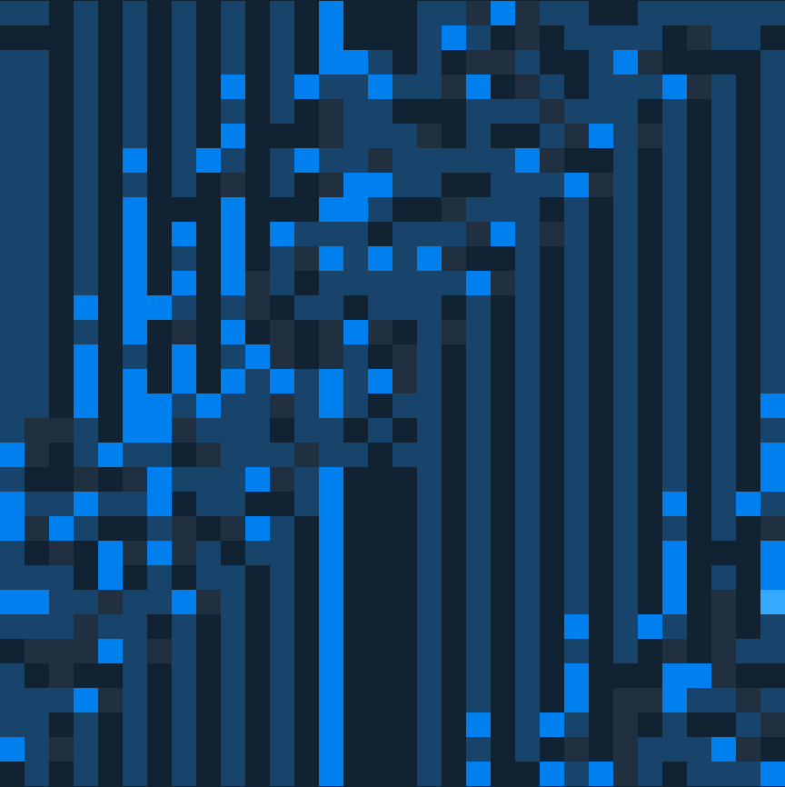
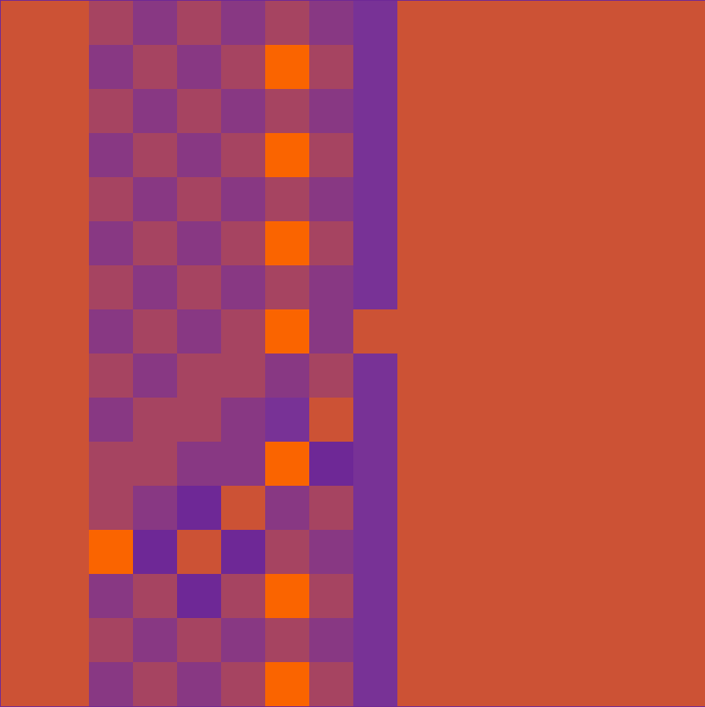
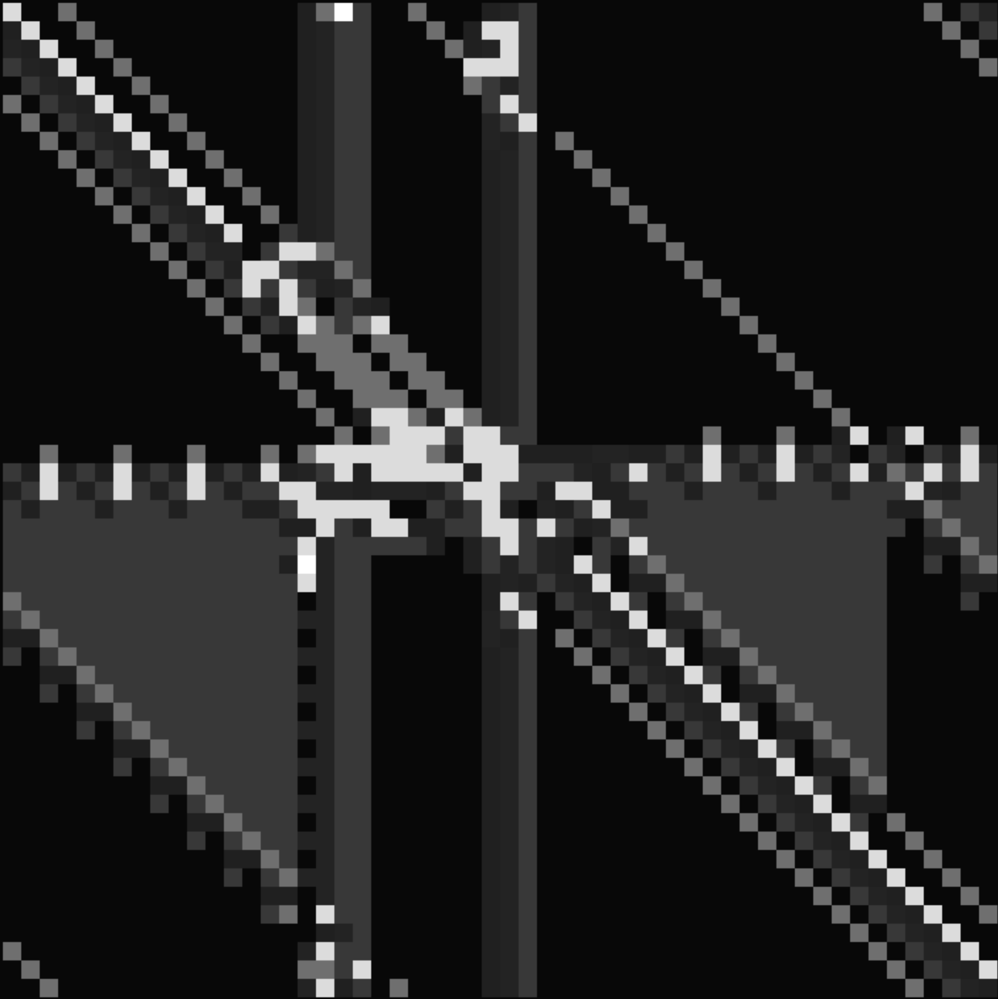
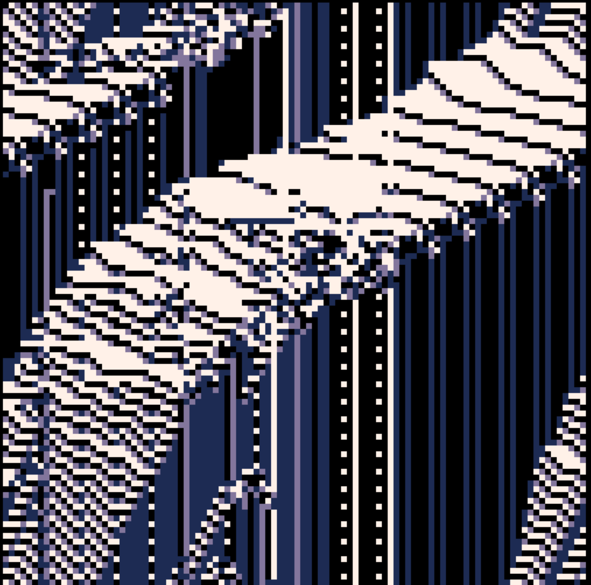
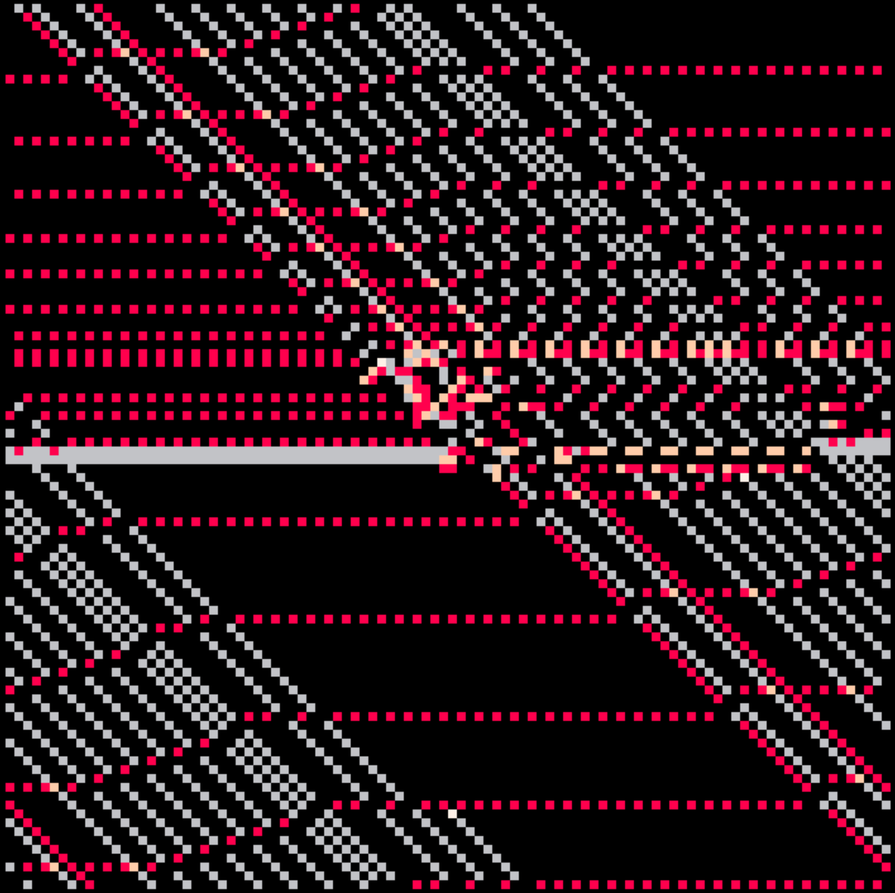
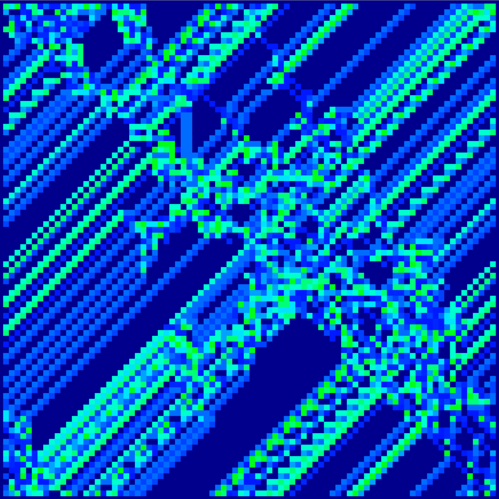

# Art + Automata -- [Demo](https://harryhinch.github.io/artomata/)
Artomata is an interactive medium that generates pseudo-random art and audio based on a simulation inspired by [turing machines](https://en.wikipedia.org/wiki/Turing_machine) and [cellular automata](https://en.wikipedia.org/wiki/Cellular_automaton). The simulation contains turing-like machines contained in a looping 2D grid, and all machine instructions are randomized at the start. Each color on the grid represents a symbol on the tape -- or a note on a synthesizer. Over time the simulation can create interesting visual patterns and features, spanning musical riffs to messy noise clusters.

## Examples

## Roadmap

 - Simulation Info Panel
 - Saving & Loading State
 - Export PNG or record audio files
 - External MIDI support?